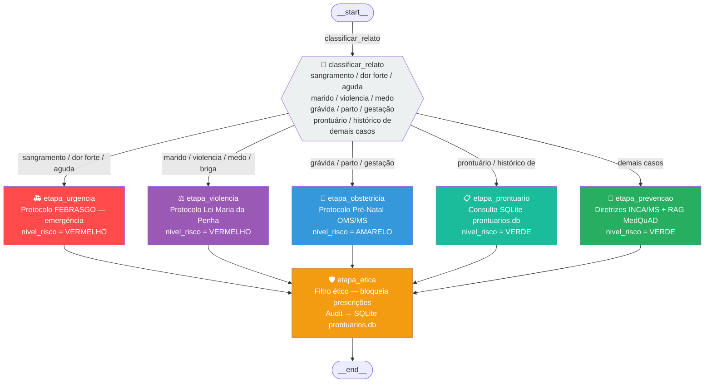

# Diagrama do Fluxo LangGraph — Consultas Medica



## Descrição dos nós

| Função Python | Nó no grafo | Responsabilidade | Fonte de dados |
| --- | --- | --- | --- |
| `etapa_urgencia` | `urgencia` | Alerta de emergência — encaminha para pronto-socorro | Hardcoded |
| `etapa_violencia` | `violencia` | Protocolo de acolhimento — Ligue 180, CREAS | Hardcoded |
| `etapa_obstetricia` | `obstetricia` | Orienta pré-natal (Ácido Fólico, consultas, exames) | RAG (MedQuAD) + hardcoded + prontuário |
| `etapa_prontuario` | `prontuario` | Consulta e exibe prontuário da paciente por nome | SQLite `prontuarios.db` |
| `etapa_prevencao` | `prevencao` | Responde dúvidas clínicas preventivas (mama, papanicolau, etc.) | RAG (FAISS/MedQuAD) + LLM + prontuário |
| `etapa_etica` | `seguranca_etica` | Filtra prescrições/dosagens e grava auditoria no SQLite | Regras fixas |

## Estado do grafo (`EstadoAtendimento`)

```python
class EstadoAtendimento(TypedDict):
    relato: str               # pergunta/relato da paciente
    protocolo_seguranca: bool # True quando violência doméstica detectada
    nivel_risco: str          # VERDE | AMARELO | VERMELHO
    resposta_final: str       # resposta gerada pelo pipeline
```
