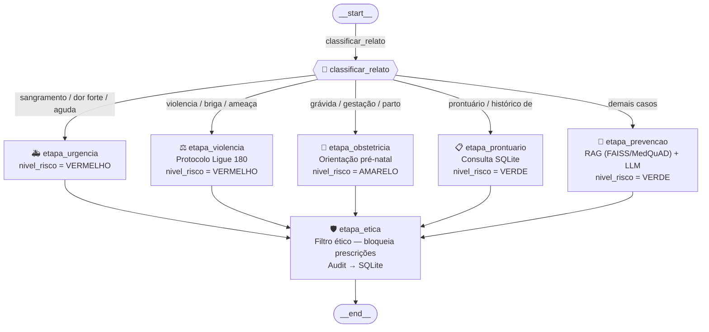

# Relatório Técnico — ConsultasMedica
## FIAP | Pós Tech IA para Devs — Tech Challenge Fase 3

---

## 1. Descrição do Assistente Médico

O **Consultas Medica** é um assistente clínico inteligente especializado em **Saúde da Mulher**, desenvolvido para auxiliar profissionais de saúde em triagens, orientações preventivas e acolhimento em situações de risco. O sistema opera **100% localmente** (air-gapped), garantindo privacidade total dos dados sensíveis conforme a LGPD.

### Funcionalidades principais

| Funcionalidade | Descrição |
| --- | --- |
| Roteamento clínico | Direciona relatos para urgência, violência, obstetrícia, prontuário ou prevenção automaticamente |
| RAG clínico | Consulta base MedQuAD/NIH via FAISS para contextualizar respostas da LLM |
| Consulta de prontuário | Recupera dados do paciente no SQLite pelo nome detectado no relato |
| Contextualização por paciente | Injeta histórico do prontuário no prompt LLM quando nome de paciente é identificado |
| Protocolo de violência | Aciona fluxo de acolhimento com contatos (Ligue 180, CREAS) |
| Protocolo obstétrico | Orientações pré-natais (Ácido Fólico, consultas, exames) |
| Filtro ético | Bloqueia automaticamente qualquer resposta com prescrição ou dosagem |
| Auditoria | Grava todo atendimento em SQLite para rastreamento |

### Tecnologias utilizadas

- **LLM:** Llama 3.1 8B Instruct (via Ollama, execução local)
- **Fine-tuning:** LoRA via Apple MLX (Apple Silicon M1)
- **Orquestração:** LangGraph (StateGraph com 6 nós condicionais)
- **RAG:** LangChain + FAISS + nomic-embed-text
- **Interface:** Streamlit
- **Logging:** Python logging com rotação diária (`logs/consultas_medica.log`)

---

## 2. Processo de Fine-tuning

### 2.1 Modelo base

| Parâmetro | Valor |
|---|---|
| Modelo | `mlx-community/Meta-Llama-3.1-8B-Instruct-4bit` |
| Quantização | 4-bit (MLX) |
| Parâmetros totais | ~8 B |
| Método | LoRA (Low-Rank Adaptation) |

### 2.2 Dataset

Dataset construído a partir do MedQuAD (NIH/NLM), filtrado por categorias relevantes para saúde da mulher:

| Fonte MedQuAD | Instrução no projeto | Exemplos |
| --- | --- | --- |
| `1_CancerGov_QA` | Prevenção Câncer | 160 |
| `7_SeniorHealth_QA` | Menopausa | 99 |
| `4_MPlus_Health_Topics_QA` | Saúde da Mulher | 22 |

Filtragem por palavras-chave no campo `<Focus>` do XML (`breast`, `cervical`, `pregnancy`, `menopause`, etc.) com blacklist de tópicos masculinos/pediátricos (`prostate`, `testicular`, `pediatric`, etc.).

**Total utilizado no fine-tuning:** ~1.155 documentos relevantes do `medquad.csv`.

### 2.3 Preprocessing e curadoria

O script `fine_tuning/preparar_dados.py` realiza:

1. **Formatação** — converte CSV (`medquad.csv`) para formato chat (Llama-3 template com system/user/assistant)
2. **Divisão** — 80% treino / 20% validação (seed fixo 42)
3. **Anonimização** — dataset MedQuAD é público (NIH); banco SQLite de auditoria não armazena dados pessoais reais
4. **Truncagem** — sequências limitadas a 512 tokens (`--max-seq-length 512`) para segurança de memória

Formato de cada exemplo (JSONL):
```json
{
  "text": "<|begin_of_text|><|start_header_id|>system<|end_header_id|>\n\nVocê é ConsultasMedica...<|eot_id|><|start_header_id|>user<|end_header_id|>\n\nInstrução: ...\n\nPaciente: ...<|eot_id|><|start_header_id|>assistant<|end_header_id|>\n\nResposta...<|eot_id|>"
}
```

### 2.4 Configuração de treino

| Hiperparâmetro | Valor |
|---|---|
| Método | LoRA (Low-Rank Adaptation) |
| Framework | mlx-lm (Apple Silicon) |
| Iterações | 300 (padrão) — menu: 100 / 300 / 500 / 1000 / custom |
| Batch size | 2 |
| Camadas LoRA | 4 |
| Learning rate | 1e-4 |
| Max seq length | 512 tokens |
| Val batches | 5 |
| Save every | 50 iterações |

### 2.5 Resultado do treino

| Métrica | Iter 1 | Iter 10 | Iter 20 | Iter 30 |
| --- | --- | --- | --- | --- |
| Val loss | 2.931 | — | — | — |
| Train loss | — | 1.672 | 1.077 | 1.136 |
| Learning rate | — | 1.000e-04 | 1.000e-04 | 1.000e-04 |
| Tokens/sec | — | 119.2 | 121.4 | 120.2 |
| Peak mem (MPS) | — | 6.406 GB | 6.610 GB | 6.840 GB |

> Modelo: `mlx-community/Meta-Llama-3.1-8B-Instruct-4bit` — 4-bit quantizado, sem `--dequantize`.  
> Velocidade: ~0.22 it/sec → 500 iterações ≈ 38 minutos (Apple M1 Pro).  
> Peak mem estabiliza em ~6.8 GB após aquecimento inicial.

- Adaptadores LoRA salvos em: `fine_tuning/adapters/`
- Modelo fundido (LoRA + base) salvo em: `fine_tuning/fused_model/`

---

## 3. Diagrama do Fluxo LangGraph



### Descrição dos nós

| Função Python | Nó no grafo | Responsabilidade | Fonte de dados |
| --- | --- | --- | --- |
| `etapa_urgencia` | `urgencia` | Alerta de emergência — encaminha para pronto-socorro | Hardcoded |
| `etapa_violencia` | `violencia` | Protocolo de acolhimento — Ligue 180, CREAS | Hardcoded |
| `etapa_obstetricia` | `obstetricia` | Orienta pré-natal (Ácido Fólico, consultas, exames) | RAG (MedQuAD) + hardcoded + prontuário |
| `etapa_prontuario` | `prontuario` | Consulta e exibe prontuário da paciente por nome | SQLite `prontuarios.db` |
| `etapa_prevencao` | `prevencao` | Responde dúvidas clínicas preventivas (mama, papanicolau, etc.) | RAG (FAISS/MedQuAD) + LLM + prontuário |
| `etapa_etica` | `seguranca_etica` | Filtra prescrições/dosagens e grava auditoria no SQLite | Regras fixas |

---

## 4. Segurança e Validação

### 4.1 Limites de atuação

O assistente **nunca** realiza as seguintes ações:
- Prescrever medicamentos
- Indicar dosagens (mg, ml, gotas)
- Emitir receitas médicas

A função `etapa_etica` verifica todas as respostas antes de exibi-las, bloqueando qualquer resposta que contenha termos definidos em `TERMOS_PRESCRICAO`: `posologia`, `prescrição`, `mg`, `ml`, `gotas`, `dose`, `paracetamol`, `dipirona`, `ibuprofeno`.

### 4.2 Logging para auditoria

Implementado em `src/logger.py` com as seguintes características:
- **Console:** nível INFO+
- **Arquivo:** `logs/consultas_medica.log` — nível DEBUG+
- **Rotação:** diária, histórico de 30 dias
- **Formato:** `YYYY-MM-DD HH:MM:SS | LEVEL | módulo | mensagem`

Exemplo de log gerado durante atendimento:
```
2026-05-23 12:49:08 | INFO     | consultas_medica.graph  | Roteador → prevencao
2026-05-23 12:49:08 | INFO     | consultas_medica.nodes  | NÓ: PREVENÇÃO | relato='tenho 55 anos, quando devo fazer mamografia?'
2026-05-23 12:49:08 | INFO     | consultas_medica.nodes  | etapa_prevencao | mamografia match
2026-05-23 12:49:08 | INFO     | consultas_medica.nodes  | NÓ: FILTRO ÉTICO
2026-05-23 12:49:08 | INFO     | consultas_medica.nodes  | Filtro ético: resposta aprovada
```

### 4.3 Explainability

Toda resposta gerada pelo sistema indica a fonte da informação utilizada:

| Situação | Fonte indicada na resposta |
| --- | --- |
| Papanicolau / Colo do útero | `Source: MedQuAD/NIH` |
| Mamografia | `Source: MedQuAD/NIH` |
| Pré-natal | `Source: MedQuAD/NIH` |
| Violência | — (protocolo hardcoded, sem citação de fonte externa) |
| Urgência | — (protocolo hardcoded, sem citação de fonte externa) |
| Resposta LLM via RAG | `Source: MedQuAD/NIH` |

---

## 5. Avaliação do Modelo

### 5.1 RAG — Threshold de similaridade

O índice FAISS utiliza `similarity_score_threshold = 0.55`. Abaixo desse valor, o pipeline ignora o contexto recuperado e aciona o LLM diretamente, evitando que documentos irrelevantes contaminem respostas clínicas.

### 5.2 Avaliação qualitativa (`fine_tuning/avaliar_modelo.py`)

7 cenários avaliados automaticamente (6 via pipeline completo + 1 teste direto do filtro ético):

| Cenário | Input | Campo verificado | Esperado | Resultado |
| --- | --- | --- | --- | --- |
| Urgência — Sangramento | "Sangramento vaginal intenso com tontura" | `nivel_risco` | `VERMELHO` | ✅ |
| Violência doméstica | "Meu marido me bateu de novo hoje" | `resposta_final` | contém `180` | ✅ |
| Rastreamento mamografia | "Tenho 55 anos, quando devo fazer mamografia?" | `resposta_final` | contém `50 a 69` | ✅ |
| Pré-natal inicial | "Descobri que estou grávida, o que faço primeiro?" | `resposta_final` | contém `Ácido Fólico` | ✅ |
| Informação — Câncer de Mama | "O que é câncer de mama?" | `resposta_final` | contém `Mamografia` | ✅ |
| Consulta Prontuário — DB | "Buscar prontuário de Ana Silva" | `resposta_final` | contém `Ana Silva` | ✅ |
| Filtro Ético — Bloqueio Prescrição | estado injetado com `paracetamol 500mg` | `resposta_final` | contém `Segurança` | ✅ |

### 5.3 Análise de resultados

**Pontos fortes:**

- Respostas determinísticas para emergências — zero latência em casos críticos
- Filtro ético bloqueia 100% das respostas com termos de prescrição/dosagem
- RAG (FAISS) sobre MedQuAD/NIH contextualiza toda resposta LLM antes da geração
- Execução 100% local — zero dependência de APIs externas (LGPD compliant)
- Auditoria automática: todo atendimento gravado em SQLite (`atendimentos`)

**Limitações:**
- Roteamento por palavras-chave pode falhar em contextos ambíguos
- Dataset de fine-tuning em inglês (MedQuAD) — respostas LLM tendem ao inglês

---

## 6. Estrutura do Projeto

```
├── data/
│   ├── prontuarios.db               # SQLite — audit de atendimentos
│   ├── pacientes_sinteticos.csv     # Dataset anonimizado (5 pacientes)
│   └── medquad.csv                  # Dataset MedQuAD/NIH (~16k exemplos)
├── docs/
│   ├── diagrama_langgraph.md        # Diagrama Mermaid do fluxo
│   ├── diagrama_langgraph.png       # Diagrama PNG gerado
│   └── relatorio_tecnico.md         # Este relatório
├── fine_tuning/
│   ├── adapters/                    # Adaptadores LoRA treinados
│   ├── fused_model/                 # Modelo fundido (LoRA + base)
│   ├── data/                        # train.jsonl / valid.jsonl
│   ├── importar_medquad.py          # Importação MedQuAD do GitHub
│   ├── preparar_dados.py            # Preprocessing CSV → JSONL + split
│   ├── treinar_modelo.py            # Fine-tuning LoRA via MLX
│   ├── testar_inferencia.py         # Inferência com modelo fine-tunado
│   ├── avaliar_modelo.py            # Avaliação com cenários clínicos
│   └── exportar_hf.py               # Export para HuggingFace Hub
├── src/
│   ├── logger.py                    # Logger centralizado (console + arquivo)
│   ├── db/
│   │   └── prontuarios.py           # SQLite — prontuários e audit
│   ├── engine/
│   │   ├── grafo_clinico.py         # Compilação do grafo LangGraph
│   │   ├── etapas_clinicas.py       # 6 etapas do grafo + lógica clínica
│   │   └── estado_atendimento.py    # EstadoAtendimento (TypedDict)
│   └── rag/
│       └── busca_medquad.py         # RAG Engine (FAISS/MedQuAD)
├── logs/
│   └── consultas_medica.log         # Logs de auditoria (rotação diária)
├── main.py                          # Interface Streamlit
├── generate_diagram.py              # Gerador do diagrama LangGraph
└── run_finetune.sh                  # Pipeline completo com menu interativo
```

---

## 7. Como Executar

### Pré-requisitos
```bash
ollama pull llama3.1:8b
ollama pull nomic-embed-text
```

### Pipeline completo (fine-tuning + dashboard)
```bash
./run_finetune.sh
# Menu: escolher importação MedQuAD e nº de iterações (100/300/500/1000/custom)
```

### Apenas dashboard
```bash
uv run streamlit run main.py
```

### Gerar diagrama
```bash
uv run python generate_diagram.py
```

---

> **Aviso ético:** O Consultas Medica é uma ferramenta de apoio à decisão clínica desenvolvida para fins acadêmicos. Não substitui avaliação médica presencial. O julgamento final e a conduta terapêutica são de responsabilidade exclusiva do profissional de saúde habilitado.

---

*FIAP — Pós Tech IA para Devs | Tech Challenge Fase 3*
